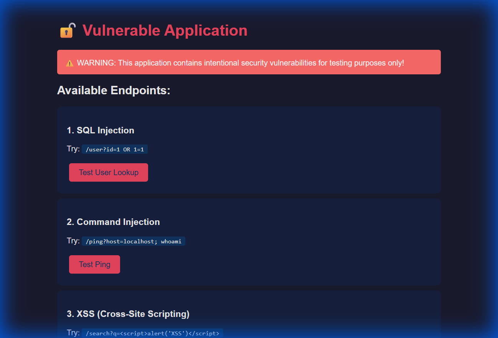
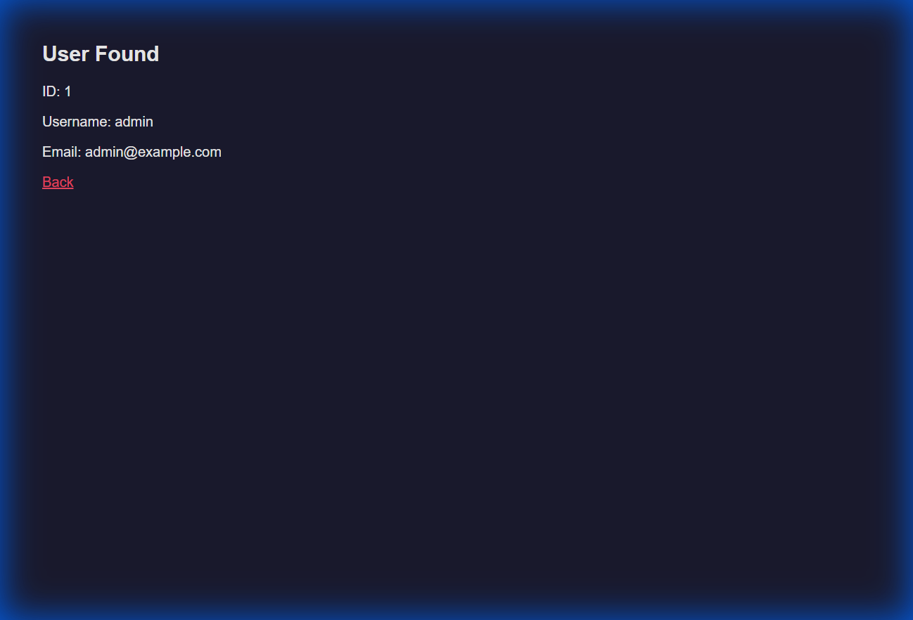
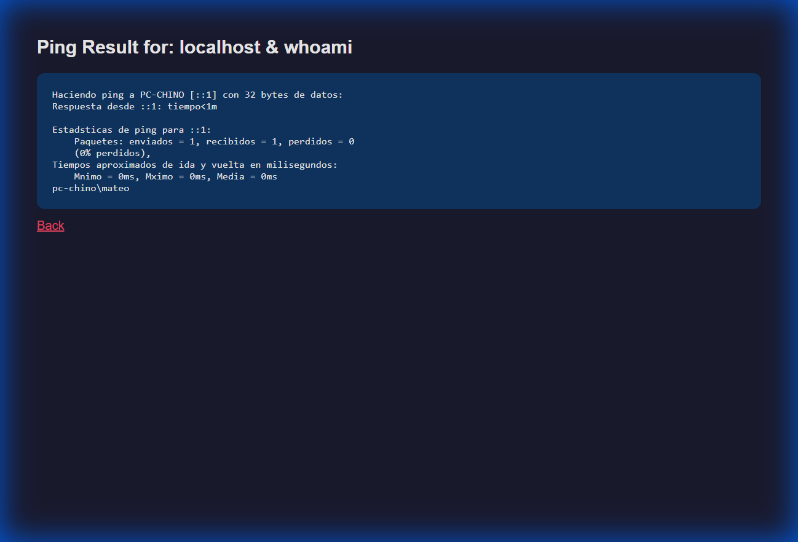
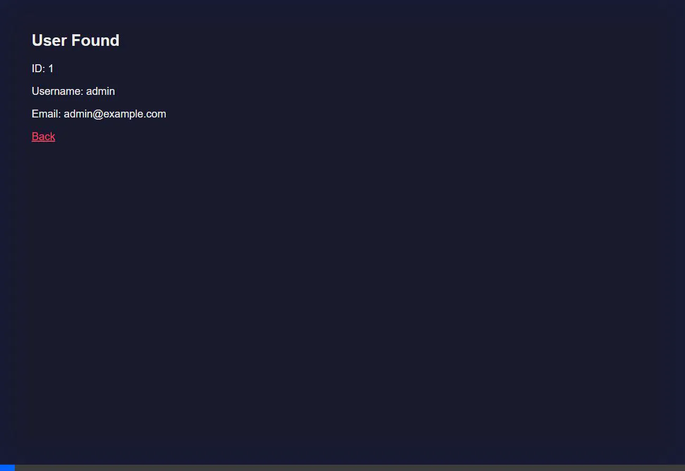

# 🔒 Pipeline de Seguridad SAST + DAST
## Guía Completa con Capturas de Pantalla

---

## 📋 Índice

1. [Introducción](#introducción)
2. [Requisitos](#requisitos)
3. [Paso 1: Instalación](#paso-1-instalación)
4. [Paso 2: SAST con Bandit](#paso-2-sast-con-bandit)
5. [Paso 3: Ejecutar la Aplicación](#paso-3-ejecutar-la-aplicación)
6. [Paso 4: DAST con OWASP ZAP](#paso-4-dast-con-owasp-zap)
7. [Resultados](#resultados)
8. [Demos de Explotación](#demos-de-explotación)

---

## Introducción

Este pipeline demuestra la integración de dos herramientas de seguridad:

| Herramienta | Tipo | Propósito |
|-------------|------|-----------|
| **Bandit** | SAST | Análisis estático del código fuente |
| **OWASP ZAP** | DAST | Análisis dinámico de la aplicación en ejecución |

### Arquitectura

```
┌──────────────┐      ┌──────────────┐      ┌──────────────┐
│   Código     │─────▶│    SAST      │─────▶│   Reporte    │
│   Python     │      │   (Bandit)   │      │   Estático   │
└──────────────┘      └──────────────┘      └──────────────┘
       │
       ▼
┌──────────────┐      ┌──────────────┐      ┌──────────────┐
│     App      │─────▶│    DAST      │─────▶│   Reporte    │
│   Running    │      │  (OWASP ZAP) │      │   Dinámico   │
└──────────────┘      └──────────────┘      └──────────────┘
```

---

## Requisitos

- ✅ Python 3.8 o superior
- ✅ Docker Desktop
- ✅ pip (gestor de paquetes Python)

---

## Paso 1: Instalación

### 1.1 Abrir Terminal

```powershell
cd C:\Users\mateo\.gemini\antigravity\scratch\security-pipeline-demo
```

### 1.2 Instalar Dependencias

```powershell
pip install -r requirements.txt
```

**Contenido de requirements.txt:**
```
flask==3.0.0
bandit==1.7.6
python-owasp-zap-v2.4==0.0.21
requests==2.31.0
```

---

## Paso 2: SAST con Bandit

### ¿Qué es SAST?
**Static Application Security Testing** - Analiza el código fuente SIN ejecutarlo, buscando patrones de vulnerabilidades.

### 2.1 Ejecutar el Análisis

```powershell
python -m bandit -r app.py -f html -o reports/bandit_report.html
```

### 2.2 Parámetros Explicados

| Parámetro | Significado |
|-----------|-------------|
| `-r app.py` | Analizar recursivamente el archivo |
| `-f html` | Formato de salida: HTML |
| `-o reports/...` | Archivo de salida |

### 2.3 Resultados SAST

Bandit detectó **9 vulnerabilidades**:

| Severidad | Cantidad | Ejemplos |
|-----------|----------|----------|
| 🔴 HIGH | 4 | Shell injection, MD5/SHA1 débil, Flask debug=True |
| 🟠 MEDIUM | 2 | SQL Injection, Bind all interfaces |
| 🟡 LOW | 3 | Passwords hardcodeados |

### 2.4 Vulnerabilidades Detectadas

```
B602 - subprocess call with shell=True (HIGH)
B324 - Use of weak MD5 hash (HIGH)  
B324 - Use of weak SHA1 hash (HIGH)
B201 - Flask debug=True (HIGH)
B608 - Possible SQL injection (MEDIUM)
B104 - Binding to all interfaces (MEDIUM)
B105 - Hardcoded password (LOW)
```

---

## Paso 3: Ejecutar la Aplicación

### 3.1 Iniciar Flask

```powershell
python app.py
```

**Salida esperada:**
```
 * Running on http://0.0.0.0:5000
 * Debug mode: on
```

### 3.2 Verificar en el Navegador

Abrir: `http://localhost:5000`

### Página Principal de la Aplicación



### Endpoints Disponibles

| Endpoint | Vulnerabilidad | Payload de Prueba |
|----------|---------------|-------------------|
| `/user?id=` | SQL Injection | `1 OR 1=1` |
| `/ping?host=` | Command Injection | `localhost & whoami` |
| `/search?q=` | XSS | `<script>alert(1)</script>` |
| `/hash?password=` | Weak Crypto | cualquier password |
| `/debug` | Info Disclosure | - |

---

## Paso 4: DAST con OWASP ZAP

### ¿Qué es DAST?
**Dynamic Application Security Testing** - Escanea la aplicación MIENTRAS está corriendo, enviando requests HTTP maliciosos.

### 4.1 Requisitos
- Docker Desktop debe estar **CORRIENDO**

### 4.2 Verificar Docker

```powershell
docker ps
```

Si funciona, verás una lista de contenedores (puede estar vacía).

### 4.3 Ejecutar OWASP ZAP

```powershell
docker run --rm -v "%cd%\reports:/zap/wrk:rw" --add-host=host.docker.internal:host-gateway ghcr.io/zaproxy/zaproxy:stable zap-baseline.py -t http://host.docker.internal:5000 -r zap_report.html -J zap_report.json -I
```

### 4.4 Parámetros Explicados

| Parámetro | Significado |
|-----------|-------------|
| `--rm` | Eliminar contenedor al terminar |
| `-v "%cd%\reports:/zap/wrk"` | Montar carpeta de reportes |
| `--add-host=host.docker.internal:host-gateway` | Acceso a localhost desde Docker |
| `zap-baseline.py` | Script de escaneo rápido |
| `-t http://...` | URL objetivo |
| `-r zap_report.html` | Generar reporte HTML |

### 4.5 Resultados DAST

ZAP detectó **8 alertas de seguridad**:

| Severidad | Cantidad | Vulnerabilidades |
|-----------|----------|------------------|
| 🟠 MEDIUM | 2 | CSP Header Missing, Anti-clickjacking Missing |
| 🟡 LOW | 4 | Spectre Isolation, Permissions Policy, Server Version Leak |
| ℹ️ INFO | 2 | Sensitive Info in URL, Cacheable Content |

---

## Resultados

### Reportes Generados

Todos los reportes se guardan en `reports/`:

```
reports/
├── bandit_report.html    # SAST - Visual
├── bandit_report.json    # SAST - Datos
├── zap_report.html       # DAST - Visual
└── zap_report.json       # DAST - Datos
```

### Resumen Ejecutivo

| Herramienta | Tipo | Total Vulnerabilidades |
|-------------|------|------------------------|
| Bandit | SAST | 9 issues |
| OWASP ZAP | DAST | 8 alertas |

---

## Demos de Explotación

### SQL Injection

**Payload:** `/user?id=1 OR 1=1`



**Resultado:** Bypass de la consulta SQL, retorna cualquier usuario.

---

### Command Injection

**Payload:** `/ping?host=localhost & whoami`



**Resultado:** Ejecutó el comando `whoami` en el servidor, revelando: `pc-chino\mateo`

---

### Video Demo Completo



---

## Comandos Rápidos

```powershell
# 1. Ir al directorio
cd C:\Users\mateo\.gemini\antigravity\scratch\security-pipeline-demo

# 2. Instalar dependencias
pip install -r requirements.txt

# 3. Ejecutar SAST
python -m bandit -r app.py -f html -o reports/bandit_report.html

# 4. Iniciar la app (en una terminal)
python app.py

# 5. Ejecutar DAST (en otra terminal, con Docker corriendo)
docker run --rm -v "%cd%\reports:/zap/wrk:rw" --add-host=host.docker.internal:host-gateway ghcr.io/zaproxy/zaproxy:stable zap-baseline.py -t http://host.docker.internal:5000 -r zap_report.html -I

# 6. Ver reportes
start reports\bandit_report.html
start reports\zap_report.html
```

---

## Conclusión

✅ **SAST (Bandit)** detecta vulnerabilidades en el código fuente
✅ **DAST (OWASP ZAP)** detecta vulnerabilidades en la aplicación en ejecución
✅ Ambos son complementarios y deben usarse juntos en un pipeline CI/CD

---

*Pipeline de Seguridad Demo - Bandit + OWASP ZAP*
